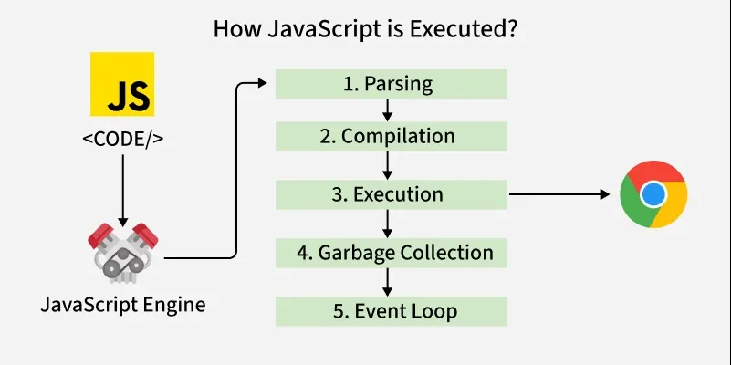
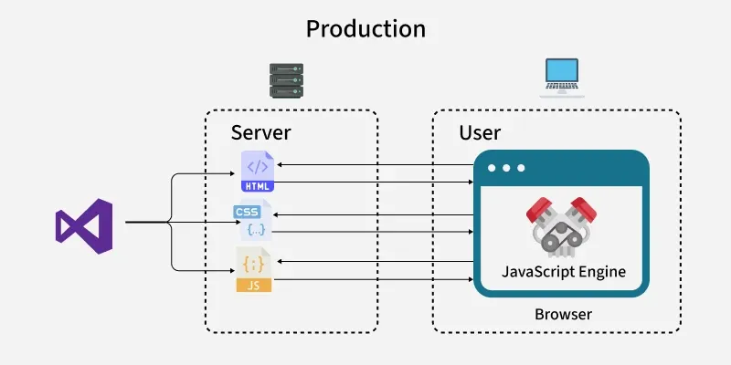

## JavaScript Code Execution 

JavaScript was initially designed to run within a web browser that has a JavaScript engine

## JavaScript At Production

In "Production Mode," your optimized HTML, CSS, and JavaScript files are deployed to a remote web server. When a user visits your site, their browser requests these files from the server. The server delivers them, and upon receiving the JavaScript files, the user's browser-based JavaScript Engine efficiently executes your code, providing a seamless and interactive user experience.
## Execution Context in JavaScript
- JavaScript code executes within an execution context, a virtual environment that manages the code’s variables, functions, and references. 
- Think of it as a container that holds everything the code needs to run, including the this keyword and scope information.

### Types of Execution Context
There are three types:

**Global Execution Context:**
- Created when your JavaScript program starts. It contains global variables (e.g., windowin browsers) and functions and is the default environment. Only one global context exists per program.
  
**Function Execution Context:** 
- Created when each time a function is called. Every function gets its own context with local variables and parameters.
- 
**Eval Execution Context:** 
- Created by the eval() function, which runs a string as code. It’s rarely used due to security risks and is unlikely to appear in interviews.